# 单机数字化平台

[toc]

## 一、版本

|                         程序版本                          |                         文档版本                          |   所有者   |  更新时间  |
| :-------------------------------------------------------: | :-------------------------------------------------------: | :--------: | :--------: |
|  |  | 闭环控制部 | 2025.08.26 |

## 二、代码开发规范

名称是以意思相近的英文描述，这样可以提高代码的可读性和理解性。

### 2.1、命名空间

Pascal（大驼峰）命名规范

```c#
namespace SomeNameSpace
{
}
```

### 2.2、类

Pascal（大驼峰）命名规范

```c#
public class SomeClass
{
}
```

#### 2.2.1、抽象类

Pascal（大驼峰）命名规范

```c#
public abstract class AbsImageCut
{
}
```

#### 2.2.2、帮助类

Pascal（大驼峰）命名规范，帮助类命名使用`名称+Helper`的方式

```c#
public class CsvHelper
{
}
```

#### 2.2.3、视图类

Pascal（大驼峰）命名规范，视图类命名使用`名称`的方式

```c#
public partial class DemoWindow : Window
{
}

public partial class DemoPage : Page
{
}
```

#### 2.2.4、视图模型类

Pascal（大驼峰）命名规范，视图模型类命名使用`VM_+名称`的方式

```c#
public class VM_DemoWinow : ViewModelBase
{
}
public class VM_DemoPage : ViewModelBase
{
}
```

#### 2.2.5、模型类

Pascal（大驼峰）命名规范

```c#
public class ThicknessIMEModel
{
}
```

### 2.3、接口

Pascal（大驼峰）命名规范，接口用`I+名称`的方式

```c#
public interface INotifyPropertyChanged
{
}
```

### 2.4、结构体

Pascal（大驼峰）命名规范

```c#
public struct WeightInfo
{
}
```

### 2.5、枚举

Pascal（大驼峰）命名规范

```c#
public enum DemoEnum
{
}
```

### 2.6、方法名

Pascal（大驼峰）命名规范

```c#
public void Method()
{
}
```

### 2.7、属性

Pascal（大驼峰）命名规范

```c#
public string Name { get; set; }
public int Age { get; set; }
```

### 2.8、字段

Camel（小驼峰）命名规范

```c#
private string flagStr;
private string _flagStr;
```

## 三、软件架构

```mermaid
graph TD;
    单机数字化平台-->SUNWODA_SEVB;
    单机数字化平台-->SUNWODA_SEVB.Component;
    单机数字化平台-->SUNWODA_SEVB.Core;
    单机数字化平台-->SUNWODA_SEVB.Data;
    单机数字化平台-->SUNWODA_SEVB.Logging;
    单机数字化平台-->SUNWODA_SEVB.PLC;
    单机数字化平台-->SUNWODA_SEVB.Tool;
    SUNWODA_SEVB-->Asset;
    SUNWODA_SEVB-->Services;
    SUNWODA_SEVB-->ViewModels;
    SUNWODA_SEVB-->Views;
    
    SUNWODA_SEVB.Component-->Animations;
    SUNWODA_SEVB.Component-->Behaviors;
    SUNWODA_SEVB.Component-->CustomControls;
    SUNWODA_SEVB.Component-->Selectors;
    SUNWODA_SEVB.Component-->Themes;
    SUNWODA_SEVB.Component-->UserControls;
    
    SUNWODA_SEVB.Core-->Attributes;
    SUNWODA_SEVB.Core-->Common;
    SUNWODA_SEVB.Core-->Converters;
    SUNWODA_SEVB.Core-->Enumerations;
    SUNWODA_SEVB.Core-->Interfaces;
    SUNWODA_SEVB.Core-->Models;
    
    SUNWODA_SEVB.Data-->Configurations;
    SUNWODA_SEVB.Data-->Context;
    SUNWODA_SEVB.Data-->Mappings;
    SUNWODA_SEVB.Data-->Models;
    SUNWODA_SEVB.Data-->Repositories;
    
    SUNWODA_SEVB.Logging-->Targets;
    
    SUNWODA_SEVB.Tool-->Converter;
    SUNWODA_SEVB.Tool-->Extension;
    SUNWODA_SEVB.Tool-->Helper;
```



### 3.1、SUNWODA_SEVB

#### 3.1.1、描述

主程序

#### 3.1.2、Assets

存放应用资产，如字体、图片、音频等。

#### 3.1.3、Assets

存放主程序服务

#### 3.1.4、ViewModels

存放三类视图模型。

- Dialogs
  - Common（公共对话框视图模型）
- Pages
  - Common（公共业务视图模型）
  - xxx项目（项目业务视图模型）
- Windows
  - Common（公共窗口视图模型）

#### 3.1.5、Views

存放视图界面。

- Dialogs
  - Common（公共对话框视图）
- Pages
  - Common（公共业务视图）
  - xxx项目（项目业务视图）
- Windows
  - Common（公共窗口视图）

#### 3.1.6、业务开发流程

- 第一步

在ViewModel.Pages和Views目录下分别新建一个文件夹，命名就是项目名称，以下是示例，所以放在示例项目文件夹下


- 第二步

在创建的项目文件中新建业务的视图(DevelopProjectDemoPage)和视图模型(VM_DevelopProjectDemoPage)

- 视图(DevelopProjectDemoPage)

需要继承Page类

DevelopProjectDemoPage.xaml

```xaml
<Page
    x:Class="SUNWODA_SEVB.Views.Pages.Demo.DevelopProjectDemoPage"
    xmlns="http://schemas.microsoft.com/winfx/2006/xaml/presentation"
    xmlns:x="http://schemas.microsoft.com/winfx/2006/xaml"
    xmlns:d="http://schemas.microsoft.com/expression/blend/2008"
    xmlns:local="clr-namespace:SUNWODA_SEVB.Views.Pages.Demo"
    xmlns:mc="http://schemas.openxmlformats.org/markup-compatibility/2006"
    Title="DevelopProjectDemoPage"
    d:DesignHeight="450"
    d:DesignWidth="800"
    mc:Ignorable="d">

    <Grid>
        <TextBlock
            HorizontalAlignment="Center"
            VerticalAlignment="Center"
            FontSize="50"
            Text="业务开发演示" />
    </Grid>
</Page>

```

DevelopProjectDemoPage.xaml.cs

```c#
using System.Windows.Controls;

namespace SUNWODA_SEVB.Views.Pages.Demo
{
    /// <summary>
    /// DevelopProjectDemoPage.xaml 的交互逻辑
    /// </summary>
    public partial class DevelopProjectDemoPage : Page
    {
        public DevelopProjectDemoPage()
        {
            InitializeComponent();
        }
    }
}

```


- 视图模型(VM_DevelopProjectDemoPage)

需要继承ViewModelBase，对其类同时设置Module特性，传入模块名和模块显示名称

VM_DevelopProjectDemoPage.cs

```c#
using SUNWODA_SEVB.Core.Attributes;
using SUNWODA_SEVB.Core.Common;

namespace SUNWODA_SEVB.ViewModels.Pages.Demo
{
    [Module("VM_DevelopProjectDemoPage", "业务项目开发Demo")]
    class VM_DevelopProjectDemoPage : ViewModelBase
    {
    }
}

```

- 第三步

编译启动，登录管理员用户，在设置界面设置好默认启动的模块名称并保存


重新运行程序即可看到新加的项目模块


- 第四步（具体业务）

  - 如需要使用日志，添加日志服务

    ```c#
    using SUNWODA_SEVB.Core.Attributes;
    using SUNWODA_SEVB.Core.Common;
    using SUNWODA_SEVB.Core.Interfaces;
    
    namespace SUNWODA_SEVB.ViewModels.Pages.Demo
    {
        [Module("VM_DevelopProjectDemoPage", "业务项目开发Demo")]
        class VM_DevelopProjectDemoPage : ViewModelBase
        {
            private readonly ILoggerService<VM_DevelopProjectDemoPage> _logger;
    
            public VM_DevelopProjectDemoPage(ILoggerService<VM_DevelopProjectDemoPage> logger)
            {
                _logger = logger;
            }
        }
    }
    ```

  - 需要读写全局变量，添加全局变量库操作服务（其他数据库表类似）

    ```c#
    using SUNWODA_SEVB.Core.Attributes;
    using SUNWODA_SEVB.Core.Common;
    using SUNWODA_SEVB.Core.Interfaces;
    using SUNWODA_SEVB.Core.Interfaces.Data;
    
    namespace SUNWODA_SEVB.ViewModels.Pages.Demo
    {
        [Module("VM_DevelopProjectDemoPage", "业务项目开发Demo")]
        class VM_DevelopProjectDemoPage : ViewModelBase
        {
            private readonly ILoggerService<VM_DevelopProjectDemoPage> _logger;
            private readonly IGlobalSettingRepository _globalSettingRepository;
    
            public VM_DevelopProjectDemoPage(
                ILoggerService<VM_DevelopProjectDemoPage> logger,
                IGlobalSettingRepository globalSettingRepository
            )
            {
                _logger = logger;
                _globalSettingRepository = globalSettingRepository;
            }
        }
    }
    ```

  - 根据业务需要重写一些ViewModelBase方法

    ```c#
    using SUNWODA_SEVB.Core.Attributes;
    using SUNWODA_SEVB.Core.Common;
    using SUNWODA_SEVB.Core.Interfaces;
    using SUNWODA_SEVB.Core.Interfaces.Data;
    
    namespace SUNWODA_SEVB.ViewModels.Pages.Demo
    {
        [Module("VM_DevelopProjectDemoPage", "业务项目开发Demo")]
        class VM_DevelopProjectDemoPage : ViewModelBase
        {
            private readonly ILoggerService<VM_DevelopProjectDemoPage> _logger;
            private readonly IGlobalSettingRepository _globalSettingRepository;
    
            public VM_DevelopProjectDemoPage(
                ILoggerService<VM_DevelopProjectDemoPage> logger,
                IGlobalSettingRepository globalSettingRepository
            )
            {
                _logger = logger;
                _globalSettingRepository = globalSettingRepository;
            }
    
            public override void OnInitialize()
            {
                // ViewModel初始化完成后调用
                // 重写OnInitialize方法，这里可以初始化一些变量数据，还有一个异步方法OnInitializeAsync
                base.OnInitialize();
            }
    
            public override void OnNavigatedFrom()
            {
                // 导航离开前调用
                // 清理一些数据，以节省内存资源，还有一个异步方法OnNavigatedFromAsync
                base.OnNavigatedFrom();
            }
    
            public override void OnNavigatedTo(object? parameter)
            {
                // 导航完成后调用，初始加载一些需要绑定的数据，还有一个异步方法OnNavigatedToAsync
                base.OnNavigatedTo(parameter);
            }
    
            public override void OnCleanup()
            {
                // ViewModel缓存回收时调用，释放资源使用，还有一个异步方法OnCleanupAsync
                base.OnCleanup();
            }
    
            public override bool CanNavigateFrom()
            {
                // 可自定义设置当前页面是否可以导航离开，还有一个异步方法CanNavigateFromAsync
                return base.CanNavigateFrom();
            }
        }
    }
    ```

  - 数据绑定示例

    - 添加绑定属性

    ```c#
    private string? bindingString;
    
    public string? BindingString
    {
        get => bindingString;
        set => SetProperty(ref bindingString, value);
    }
    ```
    
    - 赋值

    ```c#
    public override void OnNavigatedTo(object? parameter)
    {
        BindingString = "业务开发演示";
        // 导航完成后调用，加载一些需要绑定的数据，还有一个异步方法OnNavigatedToAsync
        base.OnNavigatedTo(parameter);
    }
    ```
    
    - 界面绑定

    ```xaml
    <Page
        x:Class="SUNWODA_SEVB.Views.Pages.Demo.DevelopProjectDemoPage"
        xmlns="http://schemas.microsoft.com/winfx/2006/xaml/presentation"
        xmlns:x="http://schemas.microsoft.com/winfx/2006/xaml"
        xmlns:d="http://schemas.microsoft.com/expression/blend/2008"
        xmlns:local="clr-namespace:SUNWODA_SEVB.Views.Pages.Demo"
        xmlns:mc="http://schemas.openxmlformats.org/markup-compatibility/2006"
        Title="DevelopProjectDemoPage"
        d:DesignHeight="450"
        d:DesignWidth="800"
        mc:Ignorable="d">
    
        <Grid>
            <TextBlock
                HorizontalAlignment="Center"
                VerticalAlignment="Center"
                FontSize="50"
                Text="{Binding BindingString}" />
        </Grid>
    </Page>
    ```

    

### 3.2、SUNWODA_SEVB.Component

#### 3.2.1、描述

控件库

### 3.3、SUNWODA SEVB.Core

#### 3.3.1、描述

核心库

|    文件夹    |         内容         |
| :----------: | :------------------: |
|  Attributes  |  存放所有项目的特性  |
|    Common    |  存放所有项目公共类  |
|  Converters  |  存放所有项目转换类  |
| Enumerations |   存放所有项目枚举   |
|  Interfaces  |   存放所有项目接口   |
|    Models    | 存放所有项目数据模型 |


### 3.4、SUNWODA_SEVB.Data

#### 3.4.1、描述

数据库

#### 3.4.2、数据库表

|        表名        |         用途         |
| :----------------: | :------------------: |
|      app_logs      |     应用程序日志     |
|   global_setting   |   全局用户变量设置   |
| mes_interface_logs |     MES接口日志      |
| plc_address_config |     PLC地址设置      |
|     plc_config     |     PLC设备设置      |
|   plc_rw_config    |  PLC读写地址段设置   |
|  project_setting   | 业务项目用户变量设置 |
|       users        |     用户账户信息     |
| web_interface_logs |     WEB接口日志      |
| workspace_project  |   业务项目启用配置   |


### 3.5、SUNWODASEVB.Logging

#### 3.5.1、描述

日志库

### 3.6、SUNWODA1 SEVB.PLC

#### 3.6.1、描述

PLC库

### 3.7、SUNWODASEVB.Tool

#### 3.7.1、描述

工具库


## 其他

### 线程管理

**HostedService vs ThreadManager 对比分析**

| 方面             | HostedService                     | ThreadManager                 |
| ---------------- | --------------------------------- | ----------------------------- |
| **生命周期管理** | 由.NET Host自动管理，支持优雅关闭 | 需手动管理启动/停止，容易泄露 |
| **异步支持**     | 原生支持 async/await              | 需自行实现取消机制            |
| **异常处理**     | 内置异常处理和重启机制            | 需要手动处理                  |
| **资源清理**     | 自动释放资源                      | 手动清理，容易遗漏            |
| **资源消耗**     | 基于 Task 的轻量级调度            | 每个线程占用 1MB+ 内存        |
| **取消令牌**     | 内置CancellationToken支持         | 自定义信号机制                |
| **日志集成**     | 完美集成.NET日志系统              | 需要手动集成                  |
| **依赖注入**     | 原生支持DI                        | 静态实现，难以集成DI          |
| **测试友好**     | 易于单元测试                      | 静态依赖，难以测试            |
| **现代化程度**   | .NET推荐的现代方式                | 传统线程管理方式              |

**推荐使用HostedService的理由：**

1. **更好的生命周期管理**：自动启动/停止
2. **异常恢复**：服务异常时可以自动重启
3. **优雅关闭**：支持应用关闭时的优雅处理
4. **更好的可测试性**：可以轻松进行单元测试
5. **符合.NET最佳实践**：微软推荐的后台服务模式
